# Frontend alittlemore.dev

<p align="center">
  
</p>

[🇺🇸 English version](./README.md)

Общий frontend [alittlemore.dev](https://alittlemore.dev): публичные страницы сайта и защищённые рабочие области. Angular с гибридным SSR/CSR.

| Категория               | Технологии                                                                                                                                                                                                                                                                                                   |
| ----------------------- | ------------------------------------------------------------------------------------------------------------------------------------------------------------------------------------------------------------------------------------------------------------------------------------------------------------ |
| Покрытие                |                                                                                                                                                                                                                                                  |
| Frontend                | 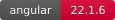 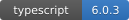 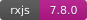 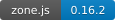 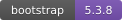 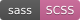                                                            |
| SSR runtime             | 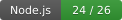 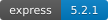 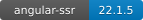                                                                                                                                                                                 |
| Редактор и контент      | 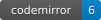 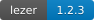 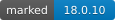 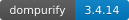 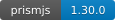                                                                                             |
| Тестирование            |   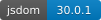 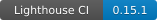                                                                                                                                  |
| Качество и безопасность | 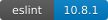 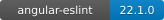 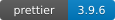  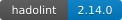  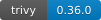 |
| Сборка и доставка       | 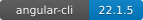    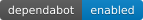                                                                               |

## Локальный запуск

Node.js — версия из [`.nvmrc`](./.nvmrc).

```bash
nvm use
make install
npm start
```

Приложение: `http://localhost:4200`, API: `http://localhost:8000`.
Полный стек запускается через `make dev` в [репозитории инфраструктуры](https://github.com/alittlemore-dev/infrastructure).

## Проверки

```bash
make format-check lint typecheck tests-coverage
```

Остальные команды сборки и проверок — в [Makefile](./Makefile).
